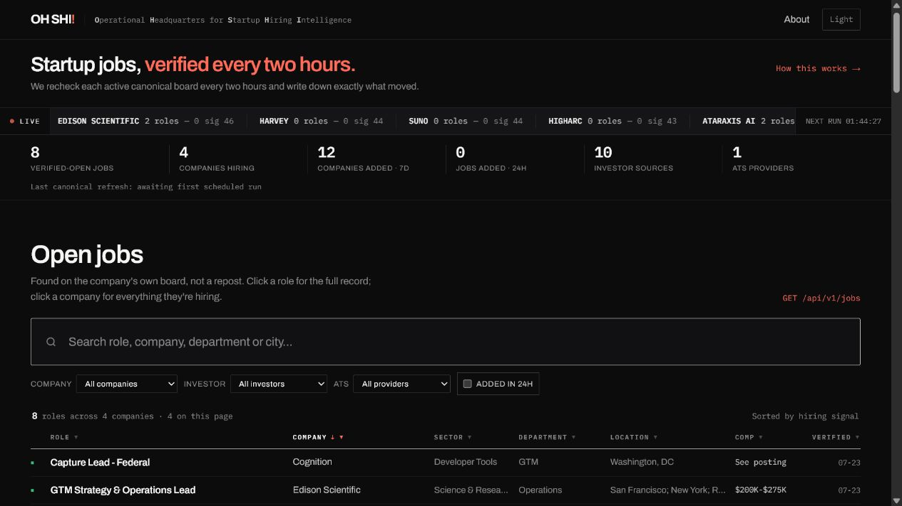
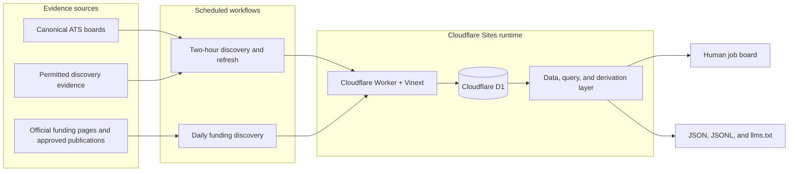
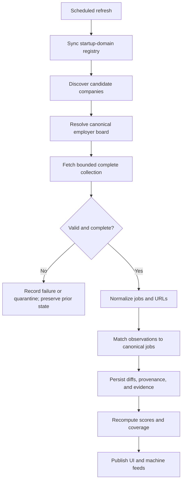

# OH SHI

[](https://github.com/lpbangun/oh-shi/actions/workflows/ci.yml)
[](LICENSE)
[](https://ohshi.work)

**OH SHI** is the **Operational Headquarters for Startup Hiring Intelligence**:
a public, evidence-first source of truth for startup companies, verified open
roles, hiring momentum, funding signals, and recent changes.

It is designed for two audiences at once:

- **People** get a fast searchable board with company context, source links,
  score explanations, sector movement, and change history.
- **Agents and data tools** get stable JSON, JSONL exports, deterministic cursor
  pagination, incremental change feeds, explicit job state, and `llms.txt`.

## Try the app

<div align="center">

**[Open the live app at ohshi.work](https://ohshi.work)**



<sub>Preview captured from the local development server using the checked-in app. Live data and counts may change between refreshes.</sub>

</div>

## Why OH SHI exists

Most job boards copy listings from somewhere else and quietly remove them when
they disappear. OH SHI treats the employer's canonical careers source as the
authority and records what happened over time.

The core rules are intentionally simple:

- A role must be found on an employer-controlled ATS or a permitted first-party
  structured careers page.
- A complete, validated source response is required before a disappearance can
  close a role.
- Openings, closures, evidence URLs, parser versions, source identity, and
  verification timestamps are stored as data, not inferred by a client.
- Closed history is retained. The public jobs feed makes state explicit with
  `verified_open` and `verified_closed`.
- Investor and directory pages are discovery evidence only; they never prove an
  opening by themselves.
- Source rights, robots rules, authentication, anti-bot controls, and rate
  limits are treated as product constraints.

## What you can do

| Audience | Starting point | What it provides |
| --- | --- | --- |
| Job seeker or researcher | [Human job board](https://ohshi.work) | Search, filter, sort, inspect companies, and open canonical source links |
| Agent or analyst | [`/api/v1/intelligence`](https://ohshi.work/api/v1/intelligence) | Preferred filtered API for jobs, companies, movements, and sectors |
| Bulk consumer | [`jobs.jsonl`](https://ohshi.work/exports/jobs.jsonl) | Stream-friendly JSONL exports for local analysis |
| Change consumer | [`daily-changes.json`](https://ohshi.work/exports/daily-changes.json) | Incremental openings, closures, funding, and company changes |
| Maintainer | [`docs/architecture.md`](docs/architecture.md) | Backend lifecycle, storage model, and public read path |

## Backend architecture

The product uses one data path for people and machines. Scheduled workflows
call protected ingestion routes, Cloudflare D1 stores canonical and provenance
records, and the same query layer feeds the UI, JSON APIs, JSONL exports, and
`llms.txt`.



The full backend sequence, storage model, and source-to-publish lifecycle are
documented in [`docs/architecture.md`](docs/architecture.md).

### Refresh lifecycle



## Data model and integrity

| Layer | Main records | Why it exists |
| --- | --- | --- |
| Canonical facts | `companies`, `jobs` | One stable public representation of a company and an opening |
| Source provenance | `job_observations`, `changes` | Preserve provider identity, source URLs, timestamps, and what moved |
| Completeness guards | `canonical_source_snapshots`, `canonical_snapshot_members` | Prove that a source response is safe to use before closing missing roles |
| Source registry | `company_sources`, `investor_sources`, `company_investors` | Track which boards and discovery sources are configured |
| Discovery | `startup_domains`, `discovery_queue`, review tables | Separate candidate discovery from verified activation |
| Operations | `ingestion_runs`, `ingestion_source_results`, `refresh_runs` | Make refresh status, errors, metrics, and retries durable |
| Hiring signals | `hiring_signals`, `hiring_signal_promotions` | Keep off-board leads separate until an exact canonical opening is verified |
| Funding | Funding receipts and movements in the data layer | Publish dated, idempotent funding announcements without rolling facts backward |

### Source adapters

The canonical adapter layer supports Ashby, Greenhouse, Lever, Workable,
Recruitee, Personio, SmartRecruiters, and bounded first-party structured career
pages. Adapters validate provider-specific shape, URLs, identity, completeness,
and eligibility before the refresh store can mutate canonical jobs.

The source policy, access status, permission decisions, and manual import path
are maintained in [`docs/discovery-sources.md`](docs/discovery-sources.md).

### What happens when a source fails

- Network, parser, schema, or completeness failures are recorded as failures or
  quarantined snapshots.
- A complete source can create a new opening, update a known opening, or close a
  role that is genuinely absent.
- A suspicious mass disappearance is quarantined and requires a separate,
  explicit operator review before any closure-only application.
- Alternate sources for one employer are processed in order so a later source
  sees the earlier source's committed identity decision.
- Refresh runs use stable run keys and idempotent writes, so retries do not
  duplicate changes or move newer facts backward.

## Hiring signal and evidence confidence

`hiringScore` is a deterministic, directional 0-100 measure of observed hiring
momentum. It is not a probability and has not been calibrated against hiring
outcomes.

| Hiring signal component | Max | Input |
| --- | ---: | --- |
| Open-role volume | 30 | Verified-open roles, log-saturating at 12 |
| Open-role growth | 30 | Net opens minus closes over the trailing 90 days |
| Funding and stage | 25 | Stage weight multiplied by funding recency |
| Board freshness | 15 | Days since the canonical board was last verified |

`evidenceConfidence` is a separate 0-100 score for evidence quality, not
company attractiveness: verification recency (40), freshly verified open-role
coverage (30), record completeness (20), and independent-source corroboration
(10).

The implementation and score receipts live in
[`lib/hiring-score.ts`](lib/hiring-score.ts), with coverage and movement
derivations in [`lib/derive.ts`](lib/derive.ts).

## Public API

### Preferred intelligence endpoint

```bash
curl -fsSL "https://ohshi.work/api/v1/intelligence?view=jobs&limit=25"
```

Supported views are `jobs`, `companies`, `movements`, and `sectors`. The endpoint
validates filters, rejects unknown parameters with HTTP 400, and returns a
deterministic cursor for the next page.

```bash
curl -fsSL "https://ohshi.work/api/v1/intelligence?view=jobs&status=verified_open&limit=25"
curl -fsSL "https://ohshi.work/api/v1/intelligence?view=companies&sector=Healthcare"
curl -fsSL "https://ohshi.work/llms.txt"
```

### Public interfaces

| Endpoint | Purpose |
| --- | --- |
| `GET /api/v1/intelligence` | Preferred capability-discovery and filtered read endpoint |
| `GET /api/v1/intelligence?view=...` | Select `jobs`, `companies`, `movements`, or `sectors` |
| `GET /api/v1/companies` | Compatibility company collection |
| `GET /api/v1/companies/:id` | One company record |
| `GET /api/v1/jobs` | Compatibility jobs collection |
| `GET /api/v1/jobs/:id` | One job record |
| `GET /api/v1/changes` | Incremental change feed |
| `GET /api/v1/coverage` | Freshness and coverage metrics |
| `GET /api/v1/signals` | Active off-board hiring signals |
| `GET /api/v1/off-board-openings` | Canonical openings verified from signal leads |
| `GET /exports/companies.jsonl` | Bulk company records |
| `GET /exports/jobs.jsonl` | Bulk job records |
| `GET /exports/daily-changes.json` | Daily movement export |
| `GET /llms.txt` | Endpoint descriptions and request recipes for agents |

Pass `?include_closed=true` to the compatibility jobs endpoint to retain closed
history. Every job record carries explicit state, source identity, canonical URL,
evidence URL, `first_seen_at`, and `last_verified_at` fields.

## Local development

### Requirements

- Node.js 22.13 or newer
- pnpm 11.17.0 or newer
- A Cloudflare D1-compatible local runtime is provided by the app tooling

### Start the app

```bash
git clone https://github.com/lpbangun/oh-shi.git
cd oh-shi
pnpm install
pnpm dev
```

Open `http://localhost:3000` in a browser. The local runtime initializes the D1
schema and seeds source-verified companies for an immediately inspectable board.

To exercise protected ingestion locally, use a throwaway token:

```bash
INGEST_TOKEN=local-only-token pnpm dev
```

Never commit real deployment tokens or local environment files.

### Quality gate

```bash
pnpm quality
```

The release gate runs, in order:

1. strict TypeScript validation;
2. deterministic data-integrity, normalization, agent-contract, scoring, and
   product-hygiene evaluations; and
3. the production build.

The build does not run when an earlier criterion fails. For the full CI-level
check, run:

```bash
pnpm quality:ci
```

That adds lint, Playwright coverage for desktop and 320px mobile, keyboard
navigation, reduced motion, pagination, agent contracts, accessibility, and the
production dependency audit.

For the evaluation criteria and test inventory, see [`evals/CRITERIA.md`](evals/CRITERIA.md).

## Scheduled operations

| Workflow | Cadence | Responsibility | Configuration |
| --- | --- | --- | --- |
| [`daily-refresh.yml`](.github/workflows/daily-refresh.yml) | Minute 30, every 2 hours | Sync the domain registry, discover candidates, refresh canonical boards, and verify freshness | Repository variable `OH_SHI_BASE_URL`; secret `OH_SHI_INGEST_TOKEN` |
| [`daily-funding-discovery.yml`](.github/workflows/daily-funding-discovery.yml) | 11:20 UTC daily | Find and publish recent, dated funding announcements for tracked companies | Same base URL and bearer secret |
| [`ci.yml`](.github/workflows/ci.yml) | Every push and pull request | Install, audit, lint, typecheck, evaluate, build, and run browser tests | No production credentials |

The refresh route is protected with `Authorization: Bearer <INGEST_TOKEN>`.
The daily funding route is idempotent and only publishes an announcement when
it names a tracked company, describes a completed raise, has a recent
publication date, and includes HTTPS evidence on the company domain or an
approved publication.

The discovery workflow runs at **minute 30 every two hours**.

### Protected operational routes

Protected routes are for maintainers and automation, not public consumption:

- `POST /api/internal/refresh`
- `POST /api/internal/funding/refresh`
- `POST /api/internal/discovery/import`
- `POST /api/internal/discovery/reviews`
- `POST /api/internal/signals/import`
- `POST /api/internal/signals/promote`
- `GET/POST /api/internal/canonical/snapshots`

Review and snapshot application paths are deliberately separate from scheduled
refresh. Staging never publishes a company or job, and mass-deletion
application requires explicit confirmation, a fresh complete source, and an
exact frozen membership match.

## Repository map

```text
.
├── app/                    # Next/Vinext pages, UI components, and API routes
├── db/                     # D1 access and schema definitions
├── drizzle/                # Additive forward-only D1 migrations
├── docs/
│   ├── architecture.md     # Backend diagrams and storage/read-path guide
│   ├── discovery-sources.md # Source policy, rights, limits, and evidence
│   └── assets/
│       └── app-preview.png # App screenshot used by this README
├── e2e/                    # Playwright browser coverage
├── evals/                  # Deterministic contract and data evaluations
├── lib/                    # Adapters, discovery, refresh, scoring, and queries
├── public/                 # Favicon, social card, robots, and agent policy
├── scripts/                # Refresh, audit, discovery, and source verifiers
├── worker/                 # Cloudflare Worker entry point
├── CONTRIBUTING.md         # Contributor workflow and source-policy checklist
├── DATA-LICENSE.md         # Data rights and third-party content boundary
└── package.json            # Commands and dependency versions
```

## Deployment and release notes

OH SHI is deployed as a Cloudflare Sites project with a D1 binding named `DB`.
For a release:

1. Preserve the existing Sites project and `DB` binding.
2. Configure the deployment `INGEST_TOKEN` secret and the GitHub Actions
   `OH_SHI_BASE_URL` variable plus `OH_SHI_INGEST_TOKEN` secret.
3. Deploy the saved source version.
4. Check `GET /api/v1/coverage` and confirm existing counts remain present.
5. Trigger one refresh and inspect its freshness receipt.
6. Inspect any mass-deletion quarantines read-only before separately approving
   an application.

The migrations are additive and forward-only. The runtime applies safe
idempotent table and column creation before reading data, which lets an existing
Sites D1 binding upgrade without dropping records.

## Contributing

Fork the repository, create a focused branch, make the smallest coherent
change, and run the relevant quality checks before opening a pull request.

Please read [`CONTRIBUTING.md`](CONTRIBUTING.md) for the PR checklist, UI
verification expectations, data/source policy, and documentation conventions.

In particular, do not add an external source just because it is technically
fetchable. New sources must be attributable, permitted, bounded, and fail
closed when the response is incomplete.

## Licensing and source rights

- Software is licensed under the [MIT License](LICENSE).
- Project-authored documentation and factual exports are offered under
  [CC BY 4.0](DATA-LICENSE.md).
- Company names, logos, job descriptions, posts, and other third-party source
  content remain with their respective owners.
- OH SHI stores concise factual fields and links back to canonical evidence; it
  does not grant rights to third-party source content.

## Links

- **Website:** [ohshi.work](https://ohshi.work)
- **GitHub:** [github.com/lpbangun/oh-shi](https://github.com/lpbangun/oh-shi)
- **Backend architecture:** [`docs/architecture.md`](docs/architecture.md)
- **Discovery and source policy:** [`docs/discovery-sources.md`](docs/discovery-sources.md)
- **Contributor guide:** [`CONTRIBUTING.md`](CONTRIBUTING.md)
- **Data license:** [`DATA-LICENSE.md`](DATA-LICENSE.md)
