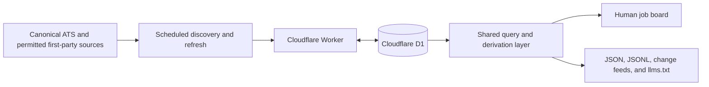

# OH SHI

[](https://github.com/lpbangun/oh-shi/actions/workflows/ci.yml)
[](LICENSE)
[](https://ohshi.work)

**OH SHI** — the **Operational Headquarters for Startup Hiring Intelligence** —
is an open, evidence-first view of startup companies, verified job openings,
hiring momentum, funding signals, and recent changes.

- **People** get a searchable hiring board with company context, source links,
  score explanations, and change history.
- **Agents and analysts** get stable JSON APIs, JSONL exports, deterministic
  pagination, explicit job state, and [`llms.txt`](https://ohshi.work/llms.txt).

**[Open the live app](https://ohshi.work)** ·
**[Explore the API](https://ohshi.work/api/v1/intelligence)** ·
**[Read the architecture](docs/architecture.md)**


> The preview comes from the checked-in app. Live data and counts change as
> sources are refreshed.

## Why it exists

Most job boards copy listings and silently remove them later. OH SHI treats an
employer's canonical careers source as the authority and retains the evidence
needed to explain when a role opened, changed, or closed.

The project follows a few strict rules:

- Only an employer-controlled ATS or permitted first-party structured careers
  page can verify an opening.
- A missing role closes only after a complete, validated source response.
- Source URLs, verification times, parser versions, and job state are durable
  data rather than client-side guesses.
- Closed history remains available with explicit `verified_open` and
  `verified_closed` states.
- Directory, investor, and news pages can suggest candidates, but cannot prove
  an opening.
- Robots rules, authentication, anti-bot controls, terms, and rate limits are
  product constraints.

See [Discovery source policy](docs/discovery-sources.md) for the complete source
and rights model.

## Quick start

### Requirements

- Node.js 22.13 or newer ([`.nvmrc`](.nvmrc) matches the CI runtime)
- pnpm 11.17.0 or newer (Corepack is recommended)

### Run locally

```bash
git clone https://github.com/lpbangun/oh-shi.git
cd oh-shi
corepack enable
pnpm install --frozen-lockfile
pnpm dev
```

Open <http://localhost:3000>. The local Cloudflare-compatible runtime creates
the D1 schema and seeds an immediately inspectable board. No production
credentials are required to browse or develop the public app.

Protected ingestion routes are optional during local development. To exercise
one, start the app with a throwaway token:

```bash
INGEST_TOKEN=local-only-token pnpm dev
```

Never commit deployment tokens or local environment files.

## Public interfaces

The intelligence endpoint is the recommended entry point:

```bash
curl -fsSL "https://ohshi.work/api/v1/intelligence?view=jobs&status=verified_open&limit=25"
```

Supported views are `jobs`, `companies`, `movements`, and `sectors`. Filters are
validated, unknown parameters return HTTP 400, and collection responses expose
a deterministic next-page cursor.

| Interface | Purpose |
| --- | --- |
| [`/api/v1/intelligence`](https://ohshi.work/api/v1/intelligence) | Preferred filtered API and capability discovery |
| [`/api/v1/companies`](https://ohshi.work/api/v1/companies) | Company collection and compatibility API |
| [`/api/v1/jobs`](https://ohshi.work/api/v1/jobs) | Job collection; pass `include_closed=true` for history |
| [`/api/v1/changes`](https://ohshi.work/api/v1/changes) | Incremental change feed |
| [`/api/v1/coverage`](https://ohshi.work/api/v1/coverage) | Freshness and source coverage |
| [`/api/v1/signals`](https://ohshi.work/api/v1/signals) | Active off-board hiring signals |
| [`companies.jsonl`](https://ohshi.work/exports/companies.jsonl) | Stream-friendly company export |
| [`jobs.jsonl`](https://ohshi.work/exports/jobs.jsonl) | Stream-friendly job export |
| [`daily-changes.json`](https://ohshi.work/exports/daily-changes.json) | Daily changes export: openings, closures, funding, and company changes |
| [`llms.txt`](https://ohshi.work/llms.txt) | Machine-readable interface guide and request recipes |

Individual company and job records are available at
`/api/v1/companies/:id` and `/api/v1/jobs/:id`.

## How it works

Scheduled workflows discover candidates and refresh canonical career sources.
Cloudflare D1 stores canonical records, observations, provenance, and safety
receipts. One query layer then serves the website and every machine interface.



Adapters currently support Ashby, Greenhouse, Lever, Workable, Recruitee,
Personio, SmartRecruiters, and bounded first-party structured career pages.
Incomplete responses, suspicious mass removals, and parser failures are
quarantined instead of closing jobs.

For the refresh sequence, storage model, and code paths, read
[`docs/architecture.md`](docs/architecture.md).

## Scores

`hiringScore` is a deterministic 0–100 measure of observed hiring momentum. Its
components are open-role volume (0–30), net role growth over 90 days (0–30),
funding stage and recency (0–25), and canonical-board freshness (0–15). It is
directional, not a probability or calibrated forecast.

`evidenceConfidence` is a separate 0–100 measure of verification recency,
canonical-board coverage, record completeness, and independent-source
corroboration. Its component weights are 40, 30, 20, and 10 respectively. It
measures evidence quality, not company attractiveness.

Source industry labels are retained and normalized into public sectors for
filtering and aggregation. The 30-day change shown in the product is roles
opened minus roles closed from the change feed during the last 30 days.

The formulas live in [`lib/hiring-score.ts`](lib/hiring-score.ts); coverage and
movement derivations live in [`lib/derive.ts`](lib/derive.ts).

## Testing

Run the fast release gate while developing:

```bash
pnpm quality
```

It runs strict TypeScript checks, deterministic evaluations, and a production
build. Before opening a pull request, run the CI-equivalent gate:

```bash
pnpm e2e:install   # once, to install Chromium
pnpm quality:ci
```

That adds lint and Playwright coverage for desktop, 320px mobile, keyboard
navigation, reduced motion, accessibility, pagination, and agent contracts.
See [`evals/CRITERIA.md`](evals/CRITERIA.md) for the evaluation inventory.

## Repository guide

| Path | Responsibility |
| --- | --- |
| `app/` | Pages, UI components, public APIs, and protected routes |
| `db/`, `drizzle/` | D1 access, schema, and additive migrations |
| `lib/` | Adapters, discovery, refresh, scoring, and queries |
| `worker/` | Cloudflare Worker entry point |
| `evals/`, `e2e/` | Deterministic and browser-level quality gates |
| `scripts/` | Refresh, audit, discovery, and source verification tools |
| `docs/` | Architecture, source policy, and release operations |
| `.github/` | CI, scheduled operations, and contribution templates |

## Contributing

Contributions are welcome. Start with [`CONTRIBUTING.md`](CONTRIBUTING.md),
which covers setup, change-specific verification, pull requests, and the source
policy checklist. Please also follow the [`CODE_OF_CONDUCT.md`](CODE_OF_CONDUCT.md)
and report vulnerabilities through [`SECURITY.md`](SECURITY.md), not a public
issue.

Good first contributions include documentation improvements, focused UI or
accessibility fixes, deterministic test coverage, and adapter hardening for an
already approved source. Proposals for new data sources should use the source
proposal issue template before implementation.

## Operations and releases

The production app uses a Cloudflare Sites project with a D1 binding named
`DB`. Scheduled refreshes require the repository variable `OH_SHI_BASE_URL`,
the GitHub Actions secret `OH_SHI_INGEST_TOKEN`, and the deployment secret
`INGEST_TOKEN`.

Canonical discovery and refresh runs at minute 30 every two hours. Funding
discovery runs daily at 11:20 UTC.

Maintainers should follow [`docs/releasing.md`](docs/releasing.md) for the
pre-release gate, migration checks, deployment verification, rollback rules,
and GitHub release notes. Changes are tracked in [`CHANGELOG.md`](CHANGELOG.md).

## License and data rights

- Source code is available under the [MIT License](LICENSE).
- Project-authored documentation and project-owned factual exports are offered
  under [CC BY 4.0](DATA-LICENSE.md).
- Company names, logos, job descriptions, posts, and other third-party content
  remain the property of their respective owners.

OH SHI publishes concise factual fields and links to canonical evidence; these
licenses do not grant rights to third-party source content.
