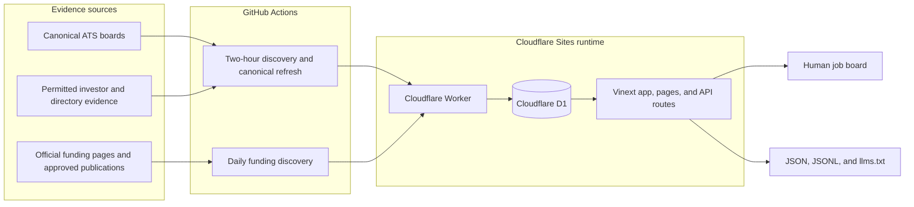
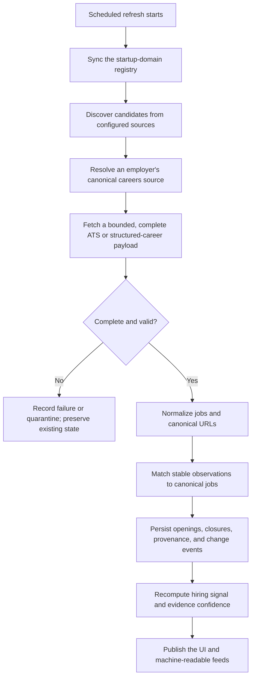
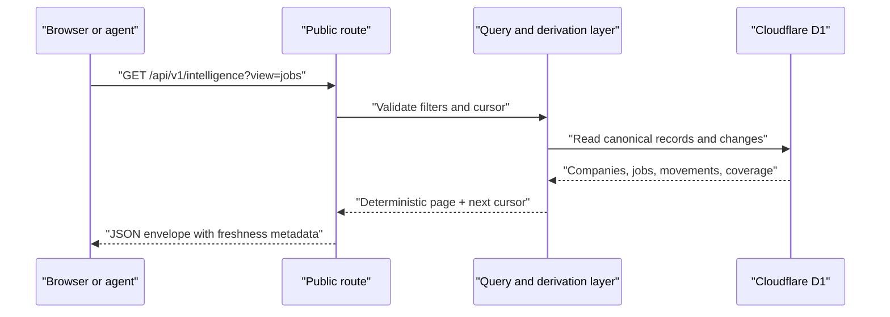

# OH SHI architecture

This page is the backend-oriented companion to the root [README](../README.md).
It describes the path from permitted evidence to a verified opening and the
public interfaces that expose the result.

## System overview

The public site and public APIs read the same D1 records. The human interface
does not have a separate copy of the data, so a person and an agent see the
same canonical job state, timestamps, evidence URLs, and score receipts.

## Refresh lifecycle

### What makes a refresh safe

- A source must return a complete validated collection before its absence can
  close jobs.
- Provider/source/external-ID identity is preferred; normalized canonical URLs
  and a conservative content match are fallbacks.
- `job_observations` keeps source-level history while `jobs` represents one
  canonical opening.
- Unexpected mass disappearance is stored as a quarantined snapshot instead of
  silently deleting or closing the board.
- Refresh runs are idempotent and carry a run key, parser version, evidence URL,
  and freshness timestamps.
- Scheduled refresh is bounded across employers and serializes alternate
  sources for one employer so identity decisions remain deterministic.

## Storage model

| Area | Tables | Purpose |
| --- | --- | --- |
| Public facts | `companies`, `jobs` | Canonical company profiles and openings consumed by the site and APIs |
| Provenance | `job_observations`, `changes`, `canonical_source_snapshots`, `canonical_snapshot_members` | Source observations, diffs, completeness checks, and reviewable evidence |
| Source registry | `company_sources`, `investor_sources`, `company_investors` | Which employer boards and discovery sources are configured |
| Discovery | `startup_domains`, `discovery_queue`, `discovery_review_batches`, `discovery_candidate_reviews` | Candidate domains, board resolution, and explicit review/activation state |
| Operations | `ingestion_runs`, `ingestion_source_results`, `refresh_runs` | Durable run status, metrics, errors, and idempotency |
| Signals | `hiring_signals`, `hiring_signal_promotions` | Off-board leads kept separate from verified openings |
| Funding | Funding movement records in the migrations and data layer | Dated, idempotent funding announcements and score recomputation |

The schema is evolved through additive Drizzle migrations in
[`drizzle/`](../drizzle/). The runtime also applies safe idempotent table and
column creation for an existing Sites D1 binding.

## Public read path

The preferred intelligence endpoint supports the `jobs`, `companies`,
`movements`, and `sectors` views. Compatibility endpoints and JSONL exports use
the same underlying data functions and deterministic ordering.

## Main code paths

| Concern | Primary files |
| --- | --- |
| Human UI | `app/page.tsx`, `app/components/JobBoard.tsx`, `app/components/RecordModal.tsx` |
| Public API | `app/api/v1/**`, `app/exports/**`, `app/llms.txt/route.ts` |
| Ingestion entry points | `app/api/internal/refresh/route.ts`, `app/api/internal/funding/refresh/route.ts`, `app/api/internal/discovery/**` |
| Discovery and refresh | `lib/discovery.ts`, `lib/refresh.ts`, `lib/canonical-refresh-store.ts` |
| ATS adapters | `lib/ats-adapters.ts`, `lib/structured-career-page.ts`, `lib/source-registry.ts` |
| Data access | `lib/data.ts`, `db/index.ts`, `db/schema.ts` |
| Scoring | `lib/hiring-score.ts`, `lib/derive.ts` |
| Scheduled operations | `.github/workflows/daily-refresh.yml`, `.github/workflows/daily-funding-discovery.yml` |

For source rights, access status, robots handling, and manual-import policy,
see [`docs/discovery-sources.md`](discovery-sources.md).
